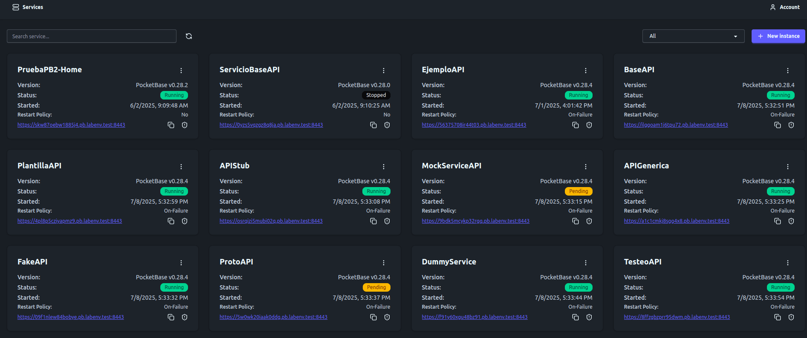

# PBLauncher

**PBLauncher** is a fast and lightweight Go-based tool for managing PocketBase instances. It lets you create, start, stop, and restart instances with a single binary. Each instance gets its own HTTPS URL and supports full custom domain configuration. Open source and easy to use.





## Local DNS Setup for `labenv.test`
To run the project locally, a DNS server is required. For this, we will use CoreDNS, which allows us to configure a wildcard test domain. In this case, we will use *.pb.labenv.test.

### 1. Download CoreDNS

[https://coredns.io/](https://coredns.io/)
Place the binary in your working directory.

### 2. Create the following files in the CoreDNS directory

#### `config`

```
. {
    bind 127.0.0.10
    forward . 1.1.1.1 1.0.0.1
    log
    errors
}

labenv.test {
    bind 127.0.0.10
    file labenv.test
    log
    errors
}
```

#### `labenv.test`

```
$TTL 60
@    IN  SOA  ns1.labenv.test. admin.labenv.test. (
           2023101601 ; Serial
           86400      ; Refresh
           7200       ; Retry
           3600000    ; Expire
           60 )       ; Minimum TTL

labenv.test.    IN  NS  ns1.labenv.test.

ns1  IN  A  127.0.0.10
pb   IN  A  127.0.0.10
*.pb IN  A  127.0.0.10
```

### 3. Run CoreDNS

```
./coredns -conf config
```

### 4. Set system DNS to `127.0.0.10`

* **Linux:**
  Edit `/etc/resolv.conf`

  ```
  nameserver 127.0.0.10
  ```

  Or set via GUI network manager.

* **Windows:**
  Set preferred DNS server to `127.0.0.10` in adapter properties.


## Setup Project

Create the following config file in the project directory:

#### `config.yml`

```yml
# Network settings
domain: pb.labenv.test

# network address where PocketBase instances listen  
# for internal use only behind the proxy  
bind_address: 127.0.0.1


listen_address: 0.0.0.0
http_port: "7080"

https: false
https_port: "8443"

disable_https_redirect: false

# Paths
download_dir: ./downloads
certificates_dir: ./.certificates
accounts_dir: ./.accounts # Let's Encrypt accounts directory
data_dir: ./data

# Certificate management
acme_email: ""
min_certificate_ttl: 720h
max_domain_cert_attempts: 1
cert_request_planner_interval: 5m
cert_request_executor_interval: 1m
certificate_check_interval: 1m

# cert:
#   provider: "cloudflare"
#   props:
#     auth_token: ""


# Sync & command checks
release_sync_interval: 5m
command_check_interval: 10s

```

To run the project, you can use `make run` or `go run *.go -c config.yml`.
For the UI, navigate to the `ui` directory and run `npm run dev`.

# Domain and SSL Certificates

For custom domains, certificates are issued using **Let's Encrypt**.

### DNS Challenge Provider Support

| Provider    | Wildcard Support |
|-------------|------------------|
| Cloudflare  | Yes              |